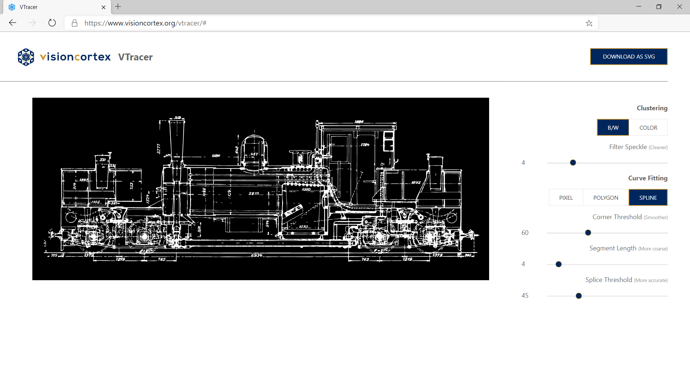
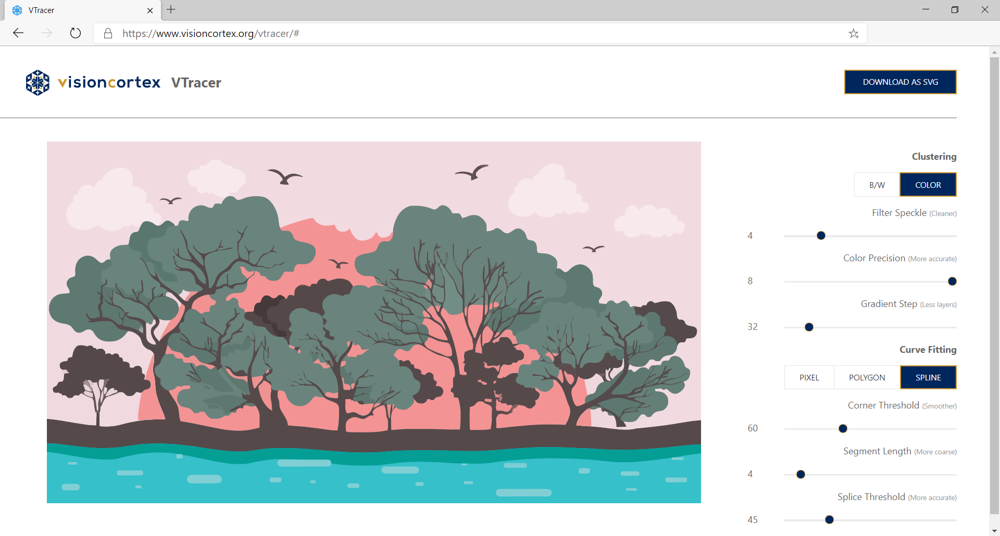

<div align="center">

  
  <h1>VTracer</h1>

  <p>
    <strong>Raster to Vector Graphics Converter built on top of visioncortex</strong>
  </p>

  <h3>
    <a href="https://www.visioncortex.org/vtracer-docs">Article</a>
    <span> | </span>
    <a href="https://www.visioncortex.org/vtracer/">Web App</a>
    <span> | </span>
    <a href="https://github.com/visioncortex/vtracer/releases">Download</a>
  </h3>

  <sub>Built with 🦀 by <a href="https://www.visioncortex.org/">The Vision Cortex Research Group</a></sub>
</div>

## Introduction

visioncortex VTracer is an open source software to convert raster images (like jpg & png) into vector graphics (svg). It can vectorize graphics and photographs and trace the curves to output compact vector files.

Comparing to [Potrace](http://potrace.sourceforge.net/) which only accept binarized inputs (Black & White pixmap), VTracer has an image processing pipeline which can handle colored high resolution scans. tl;dr: Potrace uses a `O(n^2)` fitting algorithm, whereas `vtracer` is entirely `O(n)`.

Comparing to Adobe Illustrator's [Image Trace](https://helpx.adobe.com/illustrator/using/image-trace.html), VTracer's output is much more compact (less shapes) as we adopt a stacking strategy and avoid producing shapes with holes.

VTracer is originally designed for processing high resolution scans of historic blueprints up to gigapixels. At the same time, VTracer can also handle low resolution pixel art, simulating `image-rendering: pixelated` for retro game artworks.

Technical descriptions of the [tracing algorithm](https://www.visioncortex.org/vtracer-docs) and [clustering algorithm](https://www.visioncortex.org/impression-docs).

## Web App

VTracer and its [core library](//github.com/visioncortex/visioncortex) is implemented in [Rust](//www.rust-lang.org/). It provides us a solid foundation to develop robust and efficient algorithms and easily bring it to interactive applications. The webapp is a perfect showcase of the capability of the Rust + wasm platform.





## Cmd App

```sh
visioncortex VTracer 0.6.0
A cmd app to convert images into vector graphics.

USAGE:
    vtracer [OPTIONS] --input <input> --output <output>

FLAGS:
    -h, --help       Prints help information
    -V, --version    Prints version information

OPTIONS:
        --colormode <color_mode>                 True color image `color` (default) or Binary image `bw`
    -p, --color_precision <color_precision>      Number of significant bits to use in an RGB channel
    -c, --corner_threshold <corner_threshold>    Minimum momentary angle (degree) to be considered a corner
    -f, --filter_speckle <filter_speckle>        Discard patches smaller than X px in size
    -g, --gradient_step <gradient_step>          Color difference between gradient layers
        --hierarchical <hierarchical>
            Hierarchical clustering `stacked` (default) or non-stacked `cutout`. Only applies to color mode.

    -i, --input <input>                          Path to input raster image
    -m, --mode <mode>                            Curver fitting mode `pixel`, `polygon`, `spline`
    -o, --output <output>                        Path to output vector graphics
        --path_precision <path_precision>        Number of decimal places to use in path string
        --preset <preset>                        Use one of the preset configs `bw`, `poster`, `photo`
    -l, --segment_length <segment_length>
            Perform iterative subdivide smooth until all segments are shorter than this length

    -s, --splice_threshold <splice_threshold>    Minimum angle displacement (degree) to splice a spline
```

## Downloads

You can download pre-built binaries from [Releases](https://github.com/visioncortex/vtracer/releases).

You can also install the program from source from [crates.io/vtracer](https://crates.io/crates/vtracer):

```sh
cargo install vtracer
```

> You are strongly advised to not download from any other third-party sources 

### Usage

```sh
./vtracer --input input.jpg --output output.svg
```

### Rust Library

You can install [`vtracer`](https://crates.io/crates/vtracer) as a Rust library.

```sh
cargo add vtracer
```

### Python Library

Since `0.6`, [`vtracer`](https://pypi.org/project/vtracer/) is also packaged as Python native extensions, thanks to the awesome [pyo3](https://github.com/PyO3/pyo3) project.

```sh
pip install vtracer
```

## In the wild

VTracer is used by the following products (open a PR to add yours):

<table>
  <tbody>
    <tr>
      <td><a href="https://logo.aliyun.com/logo#/name"></a>
      <br>Smart logo design
      </td>
      <td></td>
    </tr>
  </tbody>
</table>

## Citations

VTracer has since been cited by a few academic papers in computer graphics / vision research. Please kindly let us know if you have cited our work:

+ SKILL 2023 [Framework to Vectorize Digital Artworks for Physical Fabrication based on Geometric Stylization Techniques](https://www.researchgate.net/publication/374448489_Framework_to_Vectorize_Digital_Artworks_for_Physical_Fabrication_based_on_Geometric_Stylization_Techniques)
+ arXiv 2023 [Image Vectorization: a Review](https://arxiv.org/abs/2306.06441)
+ arXiv 2023 [StarVector: Generating Scalable Vector Graphics Code from Images](https://arxiv.org/abs/2312.11556)
+ arXiv 2024 [Text-Based Reasoning About Vector Graphics](https://arxiv.org/abs/2404.06479)
+ arXiv 2024 [Delving into LLMs' visual understanding ability using SVG to bridge image and text](https://openreview.net/pdf?id=pwlm6Po61I)

## How did VTracer come about?

> The following content is an excerpt from my [unpublished memoir](https://github.com/visioncortex/memoir).

At my teenage, two open source projects in the vector graphics space inspired me the most: Potrace and Anti-Grain Geometry (AGG).

Many years later, in 2020, I was developing a video processing engine. And it became evident that it requires way more investment to be commercially viable. So before abandoning the project, I wanted to publish *something* as open-source for posterity. At that time, I already developed a prototype vector graphics tracer. It can convert high-resolution scans of hand-drawn blueprints into vectors. But it can only process black and white images, and can only output polygons, not splines.

The plan was to fully develop the vectorizer: to handle color images and output splines. I recruited a very talented intern, [@shpun817](https://github.com/shpun817), to work on VTracer. I grafted the frontend of the video processing engine - the ["The Clustering Algorithm"](https://www.visioncortex.org/impression-docs#the-clustering-algorithm) as the pre-processor.

Three months later, we published the first version on Reddit. Out of my surprise, the response of such an underwhelming project was overwhelming.

## What's next?

There are several things in my mind:

1. Path simplification. Implement a post-process filter to the output paths to further reduce the number of splines.

2. Perfect cut-out mode. Right now in cut-out mode, the shapes do not share boundaries perfectly, but have seams.

3. Pencil tracing. Instead of tracing shapes as closed paths, may be we can attempt to skeletonize the shapes as open paths. The output would be clean, fixed width strokes.

4. Image cleaning. Right now the tracer works best on losslessly compressed pngs. If an image suffered from jpeg noises, it could impact the tracing quality. We might be able to develop a pre-filtering pass that denoises the input.

If you are interested in working on them or willing to sponsor its development, feel free to get in touch.
