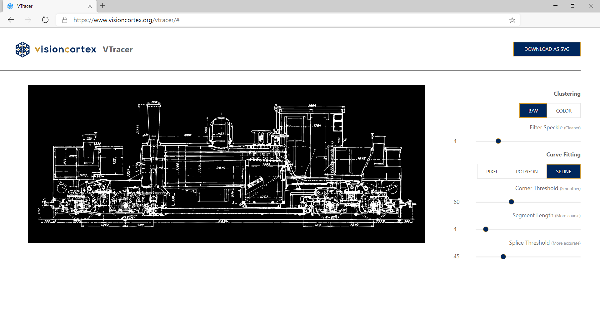
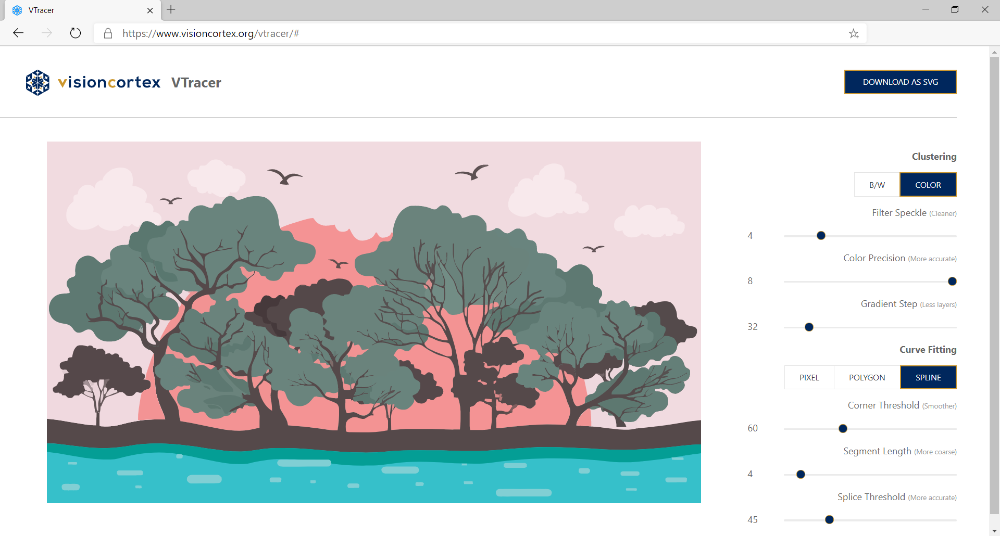

<div align="center">

  
  <h1>VTracer</h1>

  <p>
    <strong>Raster to Vector Graphics Converter</strong>
  </p>

  <h3>
    <a href="https://www.visioncortex.org/vtracer-docs">Article</a>
    <span> | </span>
    <a href="https://www.visioncortex.org/vtracer/">Web App</a>
    <span> | </span>
    <a href="https://github.com/visioncortex/vtracer/releases">Download</a>
  </h3>

</div>

## Introduction

visioncortex VTracer is an open source software to convert raster images (like jpg & png) into vector graphics (svg). It can vectorize graphics and photographs and trace the curves to output compact vector files.

Comparing to [Potrace](http://potrace.sourceforge.net/) which only accept binarized inputs (Black & White pixmap), VTracer has an image processing pipeline which can handle colored high resolution scans. tl;dr: Potrace uses a `O(n^2)` fitting algorithm, whereas `vtracer` is entirely `O(n)`.

Comparing to Adobe Illustrator's [Image Trace](https://helpx.adobe.com/illustrator/using/image-trace.html), VTracer's output is much more compact (less shapes) as we adopt a stacking strategy and avoid producing shapes with holes.

VTracer is originally designed for processing high resolution scans of historic blueprints up to gigapixels. At the same time, VTracer can also handle low resolution pixel art, simulating `image-rendering: pixelated` for retro game artworks.

Technical descriptions of the [tracing algorithm](https://www.visioncortex.org/vtracer-docs) and [clustering algorithm](https://www.visioncortex.org/impression-docs).

## Desktop App (coming soon)





## Cmd App

Input and output can be given as positional arguments or as named flags:

```sh
vtracer input.jpg output.svg
# equivalent to:
vtracer --input input.jpg --output output.svg
```

Full options (flag names are kebab-case, e.g. `--filter-speckle`):

```sh
Usage: vtracer [OPTIONS] [INPUT] [OUTPUT]

Arguments:
  [INPUT]   Input raster image (positional; or use --input)
  [OUTPUT]  Output SVG (positional; or use --output)

Options:
  -i, --input <INPUT>                        Path to the input raster image
  -o, --output <OUTPUT>                      Path to the output SVG
      --preset <PRESET>                      Start from a preset: bw, poster, photo
      --colormode <COLORMODE>                Color image `color` (default) or binary image `bw`
      --hierarchical <HIERARCHICAL>          Clustering: `stacked` (default) or `cutout` (seam-free mosaic)
  -m, --mode <MODE>                          Curve-fitting mode: `pixel`, `polygon`, `spline`
  -f, --filter-speckle <FILTER_SPECKLE>      Discard patches smaller than X px in size (0..=128)
  -p, --color-precision <COLOR_PRECISION>    Significant bits per RGB channel (1..=8)
  -g, --gradient-step <GRADIENT_STEP>        Color difference between gradient layers (0..=255)
  -c, --corner-threshold <CORNER_THRESHOLD>  Minimum momentary angle (degrees) to be a corner (0..=180)
  -l, --segment-length <SEGMENT_LENGTH>      Subdivide until all segments are shorter than this (3.5..=10)
  -s, --splice-threshold <SPLICE_THRESHOLD>  Minimum angle displacement (degrees) to splice a spline (0..=180)
      --path-precision <PATH_PRECISION>      Decimal places to use in path coordinates
      --palette <PALETTE>                    Fixed palette: comma-separated hex colors, e.g. '#112233,#445566'
      --palette-file <PALETTE_FILE>          Fixed palette from a file (hex colors, comma/newline separated)
      --max-colors <MAX_COLORS>              Auto-quantize to at most N colors
      --optimize <OPTIMIZE>                  Output optimization: 0 = off, 1 = quantize+simplify, 2 = + shorthands
  -h, --help                                 Print help
  -V, --version                              Print version
```

### New in 1.0

- **Positional arguments** — `vtracer in.png out.svg`.
- **`--hierarchical cutout`** is now a true seam-free mosaic (a gapless
  tessellation with shared boundaries), replacing the old re-clustered cutout.
- **`--palette` / `--palette-file`** — snap colors to a fixed palette
  (nearest in OKLab); **`--max-colors`** auto-quantizes the palette.
- **`--optimize`** — output size passes (coordinate quantization, redundant-
  point removal, relative/shorthand path encoding).

## Downloads

You can download pre-built binaries from [Releases](https://github.com/visioncortex/vtracer/releases).

You can also install the program from source from [crates.io/vtracer](https://crates.io/crates/vtracer):

```sh
cargo install vtracer-cli
```

> You are strongly advised to not download from any other third-party sources 

### Usage

```sh
# simplest form
./vtracer input.jpg output.svg

# black & white line art
./vtracer input.jpg output.svg --preset bw

# seam-free mosaic (gapless tessellation)
./vtracer input.jpg output.svg --hierarchical cutout

# constrain to a fixed palette
./vtracer input.jpg output.svg --palette '#1b1b1b,#e0c088,#5a7d3c,#8fb0d0'
```

### Rust Library

You can install [`vtracer`](https://crates.io/crates/vtracer) as a Rust library.

```sh
cargo add vtracer
```

### Python Library

[`vtracer`](https://pypi.org/project/vtracer/) is also packaged as a Python native extension (built with [pyo3](https://github.com/PyO3/pyo3) + [maturin](https://www.maturin.rs), from the `crates/vtracer-py` crate).

```sh
pip install vtracer
```

```python
import vtracer

# one-liners
vtracer.convert_file("in.png", "out.svg")
svg = vtracer.convert_bytes(open("in.png", "rb").read())

# rich, reusable config + presets
cfg = vtracer.Config(mode="polygon", hierarchical="cutout")
cfg.palette = ["#1b1b1b", "#e0c088", "#5a7d3c"]
svg = cfg.convert_bytes(data)
vtracer.Config.poster().convert_file("photo.jpg", "poster.svg")
```

See [`crates/vtracer-py`](crates/vtracer-py/README.md) for the full API.

### Node.js Library

[`vtracer`](https://www.npmjs.com/package/vtracer) is available for Node as a WebAssembly build (from the [`nodejs`](nodejs/README.md) package) — image decoding and vectorization both run in wasm, so there is **no native dependency**.

```sh
npm install vtracer
```

```js
const vtracer = require('vtracer');

await vtracer.convertFile('in.png', 'out.svg', { mode: 'polygon' });
const svg = vtracer.convertBuffer(buffer, { preset: 'poster' });
const svg2 = vtracer.convertPixels(rgba, width, height, { colorMode: 'bw' });
```

## Citations

VTracer has since been cited by a few academic papers in computer graphics / vision research. Please kindly let us know if you have cited our work:

+ SKILL 2023 [Framework to Vectorize Digital Artworks for Physical Fabrication based on Geometric Stylization Techniques](https://www.researchgate.net/publication/374448489_Framework_to_Vectorize_Digital_Artworks_for_Physical_Fabrication_based_on_Geometric_Stylization_Techniques)
+ arXiv 2023 [Image Vectorization: a Review](https://arxiv.org/abs/2306.06441)
+ arXiv 2023 [StarVector: Generating Scalable Vector Graphics Code from Images](https://arxiv.org/abs/2312.11556)
+ arXiv 2024 [Text-Based Reasoning About Vector Graphics](https://arxiv.org/abs/2404.06479)
+ arXiv 2024 [Delving into LLMs' visual understanding ability using SVG to bridge image and text](https://openreview.net/pdf?id=pwlm6Po61I)
