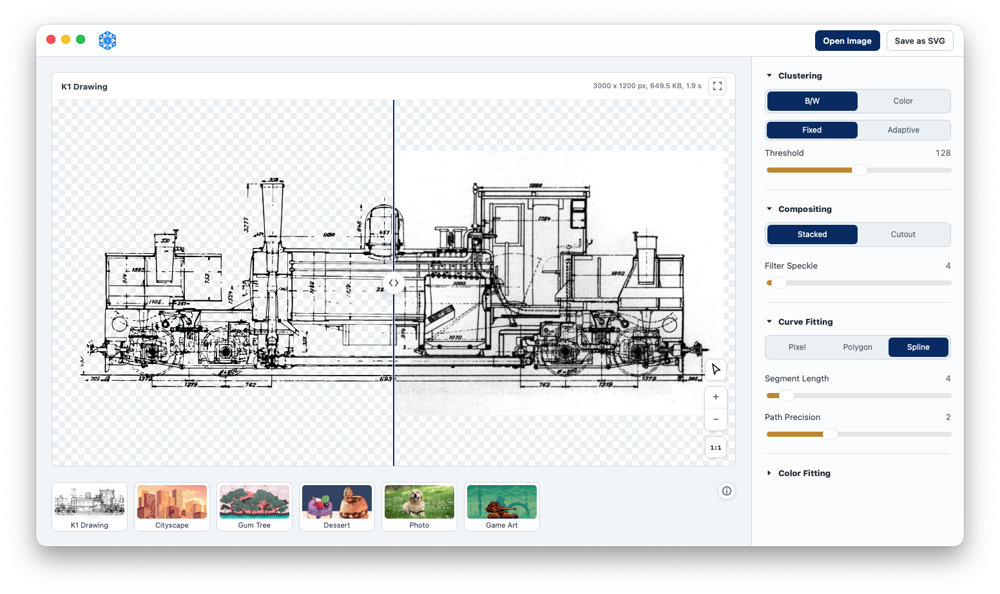

<div align="center">

  
  <h1>VTracer</h1>

  <p>
    <strong>Raster to Vector Graphics Converter</strong>
  </p>

  <h3>
    <a href="https://www.visioncortex.org/vtracer-docs">Article</a>
    <span> | </span>
    <a href="https://www.visioncortex.org/vtracer/">Web App</a>
    <span> | </span>
    <a href="https://github.com/visioncortex/vtracer/releases">Download</a>
  </h3>

  <p>
    <a href="https://crates.io/crates/vtracer"></a>
    <a href="https://pypi.org/project/vtracer/"></a>
    <a href="https://www.npmjs.com/package/@visioncortex/vtracer"></a>
  </p>

</div>

## Packages

VTracer 1.0 is a vectorization **framework** (pluggable frontends, curve fitters, color fitting, and output optimization) shipped across four surfaces from this repository:

| Package | Registry | Source | Use |
| --- | --- | --- | --- |
| `vtracer-cli` | [crates.io](https://crates.io/crates/vtracer-cli) | [`crates/vtracer-cli`](crates/vtracer-cli) | Command-line tool (`vtracer` binary) |
| `vtracer` | [crates.io](https://crates.io/crates/vtracer) | [`crates/vtracer`](crates/vtracer) | Rust library / the framework core |
| `vtracer` | [PyPI](https://pypi.org/project/vtracer/) | [`crates/vtracer-py`](crates/vtracer-py) | Python native extension (pyo3 + maturin) |
| `@visioncortex/vtracer` | [npm](https://www.npmjs.com/package/@visioncortex/vtracer) | [`nodejs`](nodejs) | Node.js WebAssembly build, no native dependency |

## Introduction

visioncortex VTracer is an open source software to convert raster images (like jpg & png) into vector graphics (svg). It can vectorize graphics and photographs and trace the curves to output compact vector files.

Comparing to [Potrace](http://potrace.sourceforge.net/) which only accept binarized inputs (Black & White pixmap), VTracer has an image processing pipeline which can handle colored high resolution scans. tl;dr: Potrace uses a `O(n^2)` fitting algorithm, whereas `vtracer` is entirely `O(n)`.

Comparing to Adobe Illustrator's [Image Trace](https://helpx.adobe.com/illustrator/using/image-trace.html), VTracer's output is much more compact (less shapes) as we adopt a stacking strategy and avoid producing shapes with holes.

VTracer is originally designed for processing high resolution scans of historic blueprints up to gigapixels. At the same time, VTracer can also handle low resolution pixel art, simulating `image-rendering: pixelated` for retro game artworks.

Technical descriptions of the [tracing algorithm](https://www.visioncortex.org/vtracer-docs) and [clustering algorithm](https://www.visioncortex.org/impression-docs).

## Desktop App (coming soon)



VTracer App features:

+ Higher performance
+ Adaptive thresholding in B/W mode
+ Perfect cutout mode
+ Fixed color palette

## Cmd App

Input and output can be given as positional arguments or as named flags:

```sh
vtracer input.jpg output.svg
# equivalent to:
vtracer --input input.jpg --output output.svg
```

Full options (flag names are kebab-case, e.g. `--filter-speckle`):

```sh
Usage: vtracer [OPTIONS] [INPUT] [OUTPUT]

Arguments:
  [INPUT]   Input raster image (positional; or use --input)
  [OUTPUT]  Output SVG (positional; or use --output)

Options:
  -i, --input <INPUT>                        Path to the input raster image
  -o, --output <OUTPUT>                      Path to the output SVG
      --preset <PRESET>                      Start from a preset: bw, poster, photo
      --clustering <CLUSTERING>              Region forming: `color-cluster` (default), `bw`, `watershed`
      --hierarchical <HIERARCHICAL>          Clustering: `stacked` (default) or `cutout` (seam-free mosaic)
  -m, --mode <MODE>                          Curve-fitting mode: `pixel`, `polygon`, `spline`
  -f, --filter-speckle <FILTER_SPECKLE>      Discard patches smaller than X px in size (0..=128)
  -p, --color-precision <COLOR_PRECISION>    Significant bits per RGB channel (1..=8)
  -g, --gradient-step <GRADIENT_STEP>        Color difference between gradient layers (0..=255)
  -c, --corner-threshold <CORNER_THRESHOLD>  Minimum momentary angle (degrees) to be a corner (0..=180)
  -l, --segment-length <SEGMENT_LENGTH>      Subdivide until all segments are shorter than this (3.5..=10)
  -s, --splice-threshold <SPLICE_THRESHOLD>  Minimum angle displacement (degrees) to splice a spline (0..=180)
      --simplify <TOLERANCE>                 Simplify curves: fewest cubics within this tolerance in px (try 1–2.5)
      --path-precision <PATH_PRECISION>      Decimal places to use in path coordinates
      --palette <PALETTE>                    Fixed palette: comma-separated hex colors, e.g. '#112233,#445566'
      --palette-file <PALETTE_FILE>          Fixed palette from a file (hex colors, comma/newline separated)
      --max-colors <MAX_COLORS>              Auto-quantize to at most N colors
      --optimize <OPTIMIZE>                  Output optimization: 0 = off, 1 = quantize+cleanup, 2 = + shorthands
      --threshold <THRESHOLD>                Binary mode: fixed threshold 0..=255 (foreground below it)
      --adaptive                             Binary mode: Bradley–Roth adaptive threshold (uneven lighting)
      --adaptive-window <ADAPTIVE_WINDOW>    Adaptive window size in px (0 = auto); implies --adaptive
      --adaptive-t <ADAPTIVE_T>              Adaptive sensitivity: % below local mean (default 15)
      --watershed-detail <WATERSHED_DETAIL>  Watershed: hierarchy cut level 0..=255 (higher = more regions)
  -h, --help                                 Print help
  -V, --version                              Print version
```

### New in 1.0

- **Positional arguments** — `vtracer in.png out.svg`.
- **`--hierarchical cutout`** is now a true seam-free mosaic (a gapless
  tessellation with shared boundaries), replacing the old re-clustered cutout.
- **`--palette` / `--palette-file`** — snap colors to a fixed palette
  (nearest in OKLab); **`--max-colors`** auto-quantizes the palette.
- **Binary thresholding** — a tunable fixed cutoff (`--threshold`) or
  **Bradley–Roth adaptive** thresholding (`--adaptive`, with `--adaptive-window`
  / `--adaptive-t`) for scans with uneven lighting.
- **`--simplify <tolerance>`** — paper.js-style curve simplification: re-fits
  smooth runs with the fewest cubics that stay within the tolerance (px),
  typically halving file size; seam-free in cutout mode because shared
  boundaries are simplified once for both faces.
- **`--clustering watershed`** — an alternative region-forming algorithm: a
  hierarchical watershed on the pixel graph (Cousty et al., TPAMI 2009; Najman,
  Cousty & Perret, ISMM 2013), cut at `--watershed-detail`. Content-adaptive
  regions that follow object shape — pairs beautifully with `cutout`.

## Downloads

You can download pre-built binaries from [Releases](https://github.com/visioncortex/vtracer/releases).

You can also install the program from source:

```sh
cargo install vtracer-cli
```

> You are strongly advised to not download from any other third-party sources 

### Usage

```sh
# simplest form
./vtracer input.jpg output.svg

# black & white line art
./vtracer input.jpg output.svg --preset bw

# scanned/photographed line art with uneven lighting
./vtracer scan.jpg output.svg --clustering bw --adaptive

# seam-free mosaic (gapless tessellation)
./vtracer input.jpg output.svg --hierarchical cutout

# watershed region forming, cut to taste
./vtracer photo.jpg output.svg --clustering watershed --watershed-detail 192

# constrain to a fixed palette
./vtracer input.jpg output.svg --palette '#1b1b1b,#e0c088,#5a7d3c,#8fb0d0'
```

### Rust Library

You can install [`vtracer`](https://crates.io/crates/vtracer) as a Rust library.

```sh
cargo add vtracer@1.0.0-alpha.1
```

```rust
use vtracer::{ColorImage, Config, FitMode, Hierarchical, Preset, Session};

// Decode with whatever you like, then hand over pixels.
let raw = image::open("in.png")?.to_rgba8();
let (width, height) = (raw.width() as usize, raw.height() as usize);
let img = ColorImage { pixels: raw.into_raw(), width, height };

// one-liner
let svg = Config::default().build()?.to_svg(&img)?;

// presets + per-field config
let mut cfg = Config::from_preset(Preset::Poster);
cfg.mode = FitMode::Polygon;
cfg.hierarchical = Hierarchical::Cutout;  // seam-free mosaic
cfg.max_colors = Some(8);
let svg = cfg.build()?.to_svg(&img)?;
```

Split the pipeline when you want the stages separately — `segment` caches, `finish` re-runs:

```rust
let pipeline = cfg.build()?;
let seg = pipeline.segment(&img)?;        // the expensive part
let doc = pipeline.finish(&seg)?;         // VectorDoc, ready to serialize
```

See [docs.rs/vtracer](https://docs.rs/vtracer/1.0.0-alpha.1/vtracer/) for the full API.

### Python Library

[`vtracer`](https://pypi.org/project/vtracer/) is also packaged as a Python native extension.

```sh
pip install --pre vtracer
```

```python
import vtracer

# one-liners
vtracer.convert_file("in.png", "out.svg")
svg = vtracer.convert_bytes(open("in.png", "rb").read())

# rich, reusable config + presets
cfg = vtracer.Config(mode="polygon", hierarchical="cutout")
cfg.palette = ["#1b1b1b", "#e0c088", "#5a7d3c"]
svg = cfg.convert_bytes(data)
vtracer.Config.poster().convert_file("photo.jpg", "poster.svg")

# watershed region forming
ws = vtracer.Config(clustering="watershed", watershed_detail=192)
svg = ws.convert_file("photo.jpg", "photo.svg")

# binary with adaptive (Bradley–Roth) thresholding
bw = vtracer.Config(clustering="bw", adaptive=True)
svg = bw.convert_file("scan.jpg", "scan.svg")
```

See [`crates/vtracer-py`](crates/vtracer-py/README.md) for the full API.

### Node.js Library

[`@visioncortex/vtracer`](https://www.npmjs.com/package/@visioncortex/vtracer) is available for Node as a WebAssembly build (from the [`nodejs`](nodejs/README.md) package) — image decoding and vectorization both run in wasm, so there is **no native dependency**. Decodes PNG, JPEG, GIF, BMP, and WebP; for other formats, decode yourself and pass raw RGBA to `convertPixels`.

```sh
npm install @visioncortex/vtracer@1.0.0-alpha.1
```

```js
const vtracer = require('@visioncortex/vtracer');

await vtracer.convertFile('in.png', 'out.svg', { mode: 'polygon' });
const svg = vtracer.convertBuffer(buffer, { preset: 'poster' });
const svg2 = vtracer.convertPixels(rgba, width, height, { clustering: 'bw' });

// binary with adaptive thresholding
const bw = vtracer.convertBuffer(buffer, { clustering: 'bw', adaptive: true });
```

## Citations

VTracer has since been cited by a few academic papers in computer graphics / vision research. Please kindly let us know if you have cited our work:

+ SKILL 2023 [Framework to Vectorize Digital Artworks for Physical Fabrication based on Geometric Stylization Techniques](https://www.researchgate.net/publication/374448489_Framework_to_Vectorize_Digital_Artworks_for_Physical_Fabrication_based_on_Geometric_Stylization_Techniques)
+ arXiv 2023 [Image Vectorization: a Review](https://arxiv.org/abs/2306.06441)
+ arXiv 2023 [StarVector: Generating Scalable Vector Graphics Code from Images](https://arxiv.org/abs/2312.11556)
+ arXiv 2024 [Text-Based Reasoning About Vector Graphics](https://arxiv.org/abs/2404.06479)
+ arXiv 2024 [Delving into LLMs' visual understanding ability using SVG to bridge image and text](https://openreview.net/pdf?id=pwlm6Po61I)
